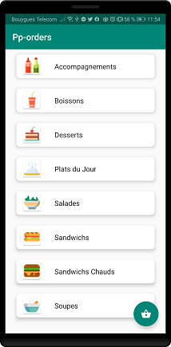
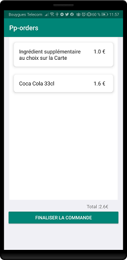

# pp-orders

Application mobile (Android Kotlin) pour commander à manger chez PetitePause.
Cette application se complete avec l'application web [pp-orders](https://pp-order.cpos-strasbourg.fr/)

## Ecrans

&ensp;

## Bibliothèques utilisés

* [Android Support Library](https://developer.android.com/topic/libraries/support-library/)
* [Android Material](https://material.io/develop/android/)
* [Android CardView](https://developer.android.com/reference/androidx/cardview/widget/CardView)
* [Retrofit](https://github.com/square/retrofit/)
* [Gson](https://github.com/google/gson/)
* TODO : définir le reste

## Développé par

Mohamed Ali Bouzrati
*   [Site perso](http://mohamed-ali-bouzrati.me/)
*   [Linkedin](https://fr.linkedin.com/in/mohamed-ali-bouzrati)